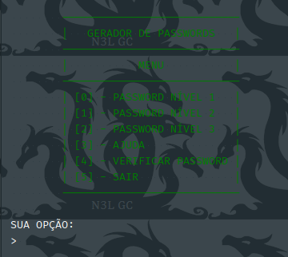
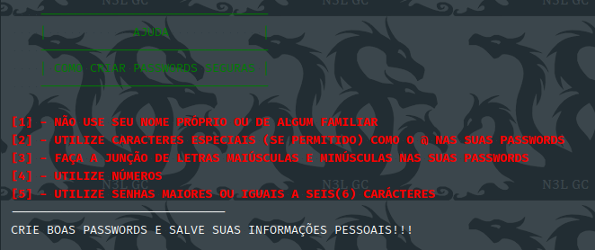
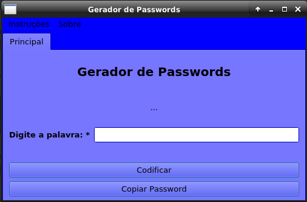
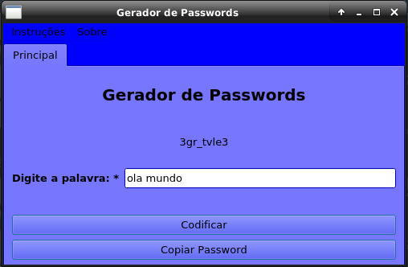
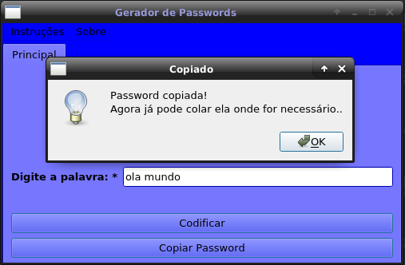
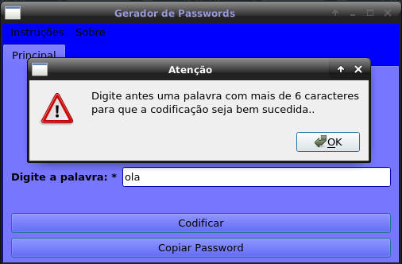
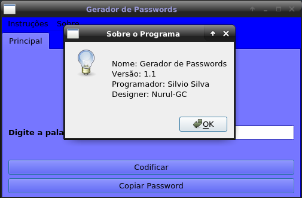

#  - Gerador de Passwords

## CLI
**Menu Principal** \

**Menu Ajuda CLI** \

---

## GUI
**Janela Principal** \

**Codificado** \

`* a codificação é feita de forma dinámica, o que significa
que uma palavra pode ter varias cifras e também é valida a
codificação de palavras separadas ex: 'meu amigo'..`

**Copiar para Colar** \

`* a opção de copiar serve para transferir o texto codificado
para o clipboard do sistema e facilitar para que o usuario
apenas cole o texto onde for preciso..`

**Retornando Erro** \

`* a palavra introduzida deve ter no minimo 6 caracteres..`

**Sobre o Programa** \

---

**_Gere passwords seguras, usando este programinha! Verifique também se a sua password é segura ou não!
Agradeço todas as opiniões e críticas! 
Sou Beginner na linguagem_** - [Silvio Silva](/#) 🖖😅
